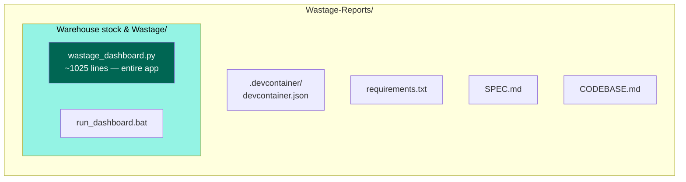
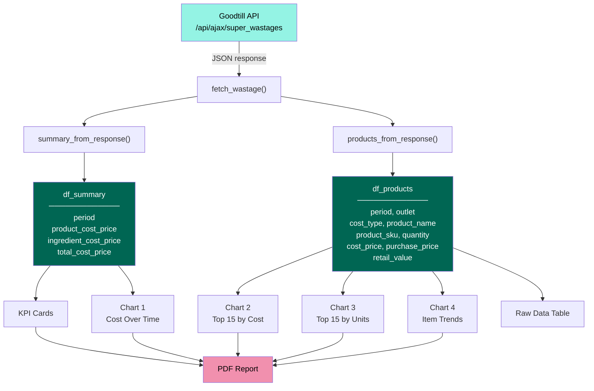
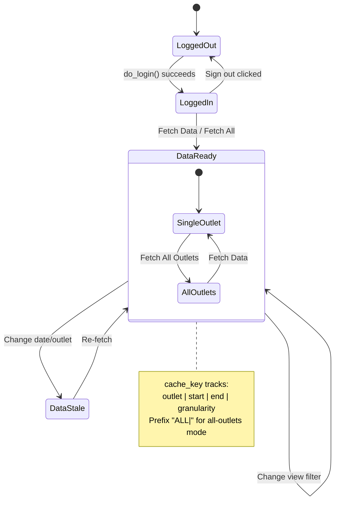
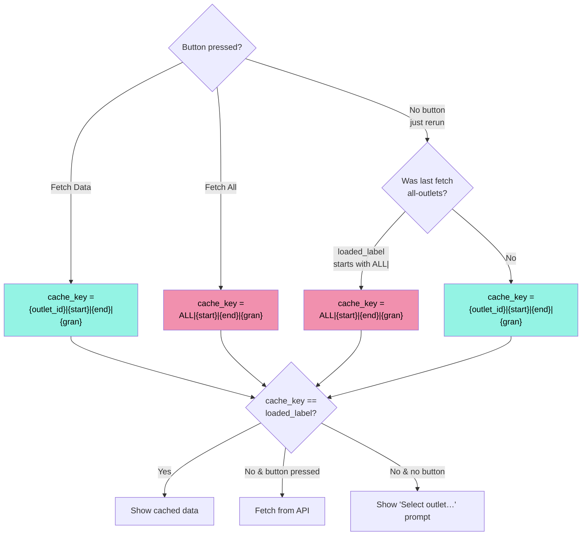

```mermaid
graph TD
    subgraph Sidebar["Sidebar (teal #006653)"]
        LOGO["EVENTS by KERB"]
        AUTH["Login / Sign Out"]
        OUTLET["Outlet Selector"]
        DATE["Date Range + Bucket Size"]
        FETCH["Fetch Data Button"]
        FETCHALL["Fetch All Outlets\n⚠️ Warning"]
    end

    subgraph Main["Main Area (warm white #FAF2EB)"]
        HEADER["Wastage Trends — {Outlet}"]
        KPIS["KPI Cards × 4"]
        TOGGLE["Products / Ingredients / Both"]
        CHART1["Wastage Cost Over Time\nStacked Bar + Line"]
        subgraph TwoCol["Side by Side"]
            CHART2["Top 15\nby Cost"]
            CHART3["Top 15\nby Units"]
        end
        CHART4["Selected Item Trends\n(conditional)"]
        RAWDATA["Raw Data Expander + CSV"]
        PDFEXPORT["PDF Export\nCommentary + Download"]
    end

    LOGO --> AUTH --> OUTLET --> DATE --> FETCH --> FETCHALL
    HEADER --> KPIS --> TOGGLE --> CHART1 --> TwoCol --> CHART4 --> RAWDATA --> PDFEXPORT

    style Sidebar fill:#006653,color:#fff
    style Main fill:#FAF2EB,color:#000
    style KPIS fill:#006653,color:#fff
    style TOGGLE fill:#006653,color:#fff
    style PDFEXPORT fill:#F190AE,color:#000
```

# Wastage Dashboard — Codebase Guide

## Project Structure

## Single-File Architecture

The entire app lives in `wastage_dashboard.py` (~1025 lines). It follows Streamlit's top-to-bottom execution model — the file runs from top to bottom on every interaction.

## File Sections

```mermaid
graph TD
    subgraph wastage_dashboard.py
        S1["1. Imports & Page Config\nlines 1–25"]
        S2["2. KERB Brand CSS\nlines 27–234"]
        S3["3. API Constants\nlines 236–240"]
        S4["4. Session State Defaults\nlines 242–255"]
        S5["5. Helper Functions\nlines 258–388"]
        S6["6. PDF Generation\nlines 391–601"]
        S7["7. Sidebar UI\nlines 604–700"]
        S8["8. Data Fetching\nlines 703–791"]
        S9["9. Dashboard Rendering\nlines 793–1025"]
    end

    S1 --> S2 --> S3 --> S4 --> S5 --> S6 --> S7 --> S8 --> S9

    style S2 fill:#F190AE,color:#000
    style S5 fill:#94F3E4,color:#000
    style S6 fill:#94F3E4,color:#000
    style S7 fill:#006653,color:#fff
    style S8 fill:#006653,color:#fff
    style S9 fill:#FAC430,color:#000
```

### Section Details

**1. Imports & Page Config** — Standard library + third-party imports. `st.set_page_config()` must be the first Streamlit call.

**2. KERB Brand CSS** — A large `st.markdown()` block injecting custom CSS via `""")` block near the top. Use `data-testid` selectors. Remember:
- Sidebar text defaults to white via `[data-testid="stSidebar"] * { color: #FFFFFF }`
- Main area text is controlled per-component
- Metric cards need explicit overrides to stay white on teal

### Changing brand colours
Update all three locations:
1. CSS variables in `:root { }` block
2. RGB tuples in `generate_pdf()` (`TEAL`, `MINT`, `PINK`, etc.)
3. Hex values in Plotly chart `marker_color` / `color_continuous_scale` properties
