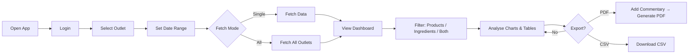
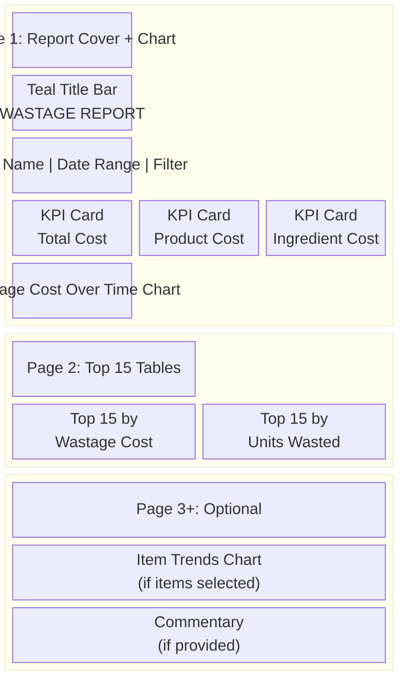
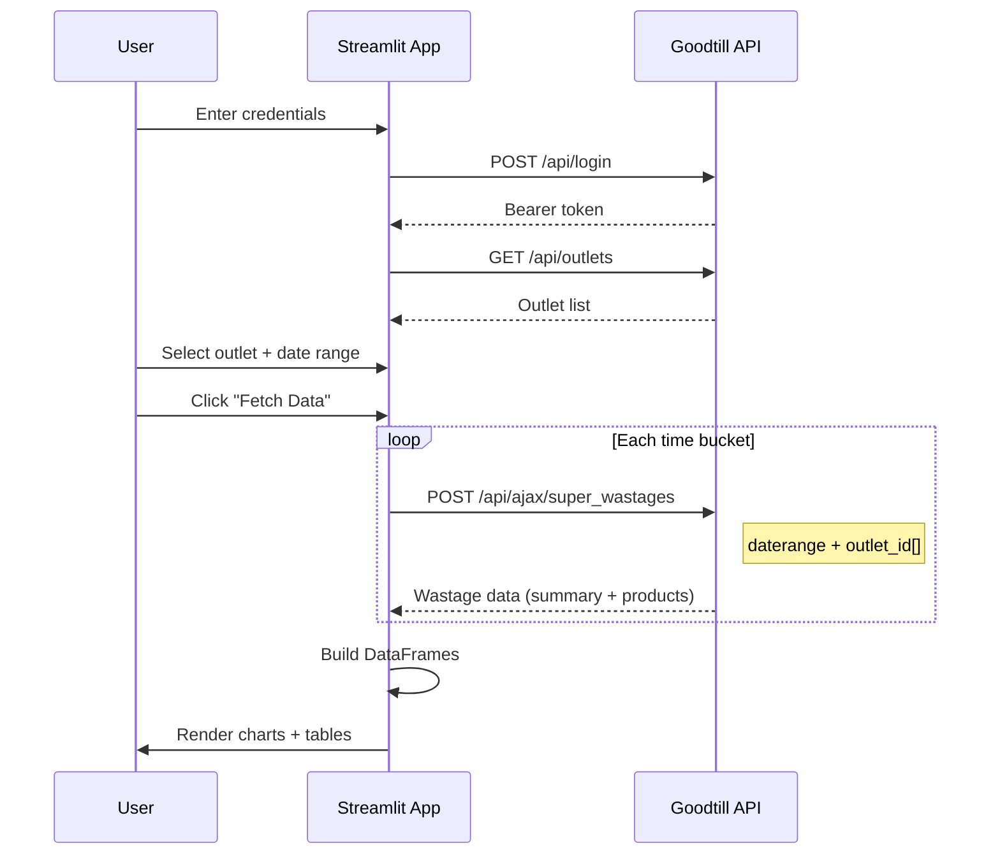
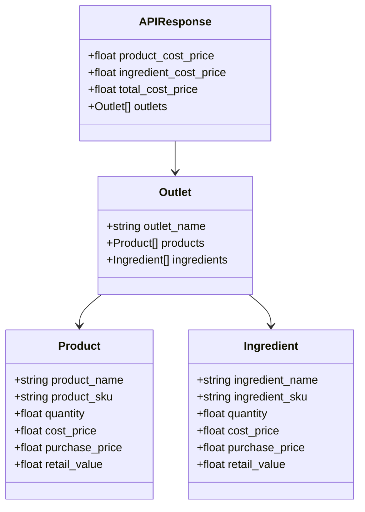
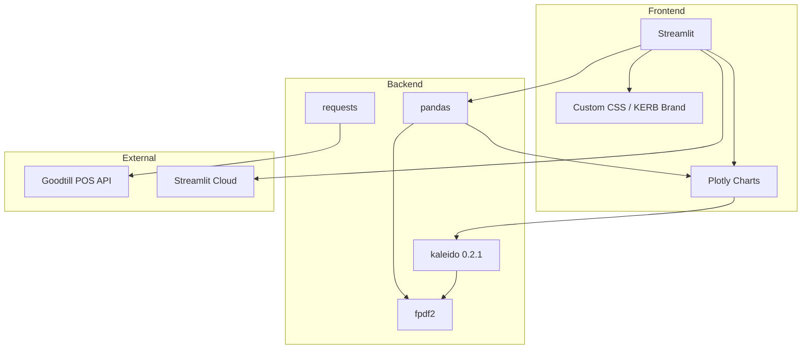

# Wastage Dashboard — Specification

## Purpose

Internal reporting tool for KERB Events that connects to the Goodtill POS API to pull wastage data across outlets and time periods, visualise trends, and export branded PDF reports.

## Users

KERB operations and management staff. Access is controlled via Goodtill credentials (subdomain + username + password).

## User Journey



## Core Features

### Authentication
- Login via Goodtill API (`/api/login`)
- Session-based token stored in Streamlit session state
- Sign out clears all cached data

### Outlet Selection
- Dropdown populated from Goodtill API (`/api/outlets`)
- **Single outlet**: Fetches data for the selected outlet
- **All outlets**: Fetches data across every outlet in a single API call per time bucket (warning displayed about longer load times)

### Date Range & Bucketing
- Configurable start/end date pickers (default: last 90 days)
- Bucket granularity: **Weekly** or **Monthly**
- Each bucket generates one API call to `/api/ajax/super_wastages`

### Data Views
- **Products / Ingredients / Both** toggle filters all charts and tables
- Toggle is a horizontal radio group

### Visualisations

| Chart | Type | Description |
|-------|------|-------------|
| Wastage Cost Over Time | Stacked bar + line | Product cost (pink) and ingredient cost (mint) stacked bars with a total line (teal). £-formatted labels on the total line. |
| Top 15 by Wastage Cost | Horizontal bar | Teal gradient, £-formatted labels outside bars |
| Top 15 by Units Wasted | Horizontal bar | Pink/amber gradient, numeric labels outside bars |
| Selected Item Trends | Line chart | Appears when items are selected in the multiselect filter. £-formatted labels on data points. |

### Data Table
- Expandable "Raw Data" section with all records matching current filters
- Columns: Period, Type, Item, SKU, Qty, Cost (£), Retail Value (£)
- CSV download button

### PDF Export
- Generates a branded landscape A4 PDF report containing:
  - Title bar with outlet name, date range, filter mode, generation timestamp
  - KPI summary cards (Total Wastage Cost, Product Cost, Ingredient Cost, Total Units Wasted)
  - Wastage Cost Over Time chart (rendered as PNG via kaleido)
  - Top 15 tables side by side (Wastage Cost + Units Wasted)
  - Selected Item Trends chart (if items are selected)
  - User commentary section (optional free-text input)
- Filename format: `{Outlet} - {Start Date} to {End Date} - Wastage Report.pdf`

### PDF Page Layout



## Branding

KERB Events brand system applied throughout:

| Element | Colour | Hex |
|---------|--------|-----|
| Background | Warm White | `#FAF2EB` |
| Sidebar / Primary | Deep Teal | `#006653` |
| Accent 1 | Mint | `#94F3E4` |
| Accent 2 | Pink | `#F190AE` |
| Emphasis | Coral | `#E9496E` |
| Text | Dark | `#1A1A1A` |

- Typography: Karla (body), DIN Condensed (headings, uppercase)
- Sidebar: teal background, white text, mint labels, pink primary buttons
- Metric cards: teal background, mint label, white value, mint left border
- Charts: brand colour palette (no default Plotly colours)
- PDF: matching brand colours with teal title bar, mint accent lines, pink section underlines

## API Communication



### Wastage API Payload
```json
{
  "daterange": "01/01/2026 12:00 AM - 31/01/2026 12:00 AM",
  "consider_ingredient_cost": 1,
  "outlet_id": ["outlet-uuid-here"]
}
```

### Wastage API Response Structure



## Tech Stack



| Component | Technology |
|-----------|-----------|
| Framework | Streamlit |
| Charts | Plotly (graph_objects + express) |
| PDF | fpdf2 |
| Chart export | kaleido 0.2.1 (bundles Chromium) |
| Data | pandas |
| API | requests |
| Hosting | Streamlit Cloud |

## Constraints & Known Limitations

- **kaleido pinned to 0.2.1**: Newer versions require system Chrome which Streamlit Cloud doesn't provide
- **All outlets mode**: Uses the API's list support for `outlet_id` — if the API doesn't properly filter by outlet list, totals may be inaccurate
- **No persistent storage**: All data is fetched on demand; no database or caching layer
- **Session-only auth**: Token is lost on browser refresh or session timeout
